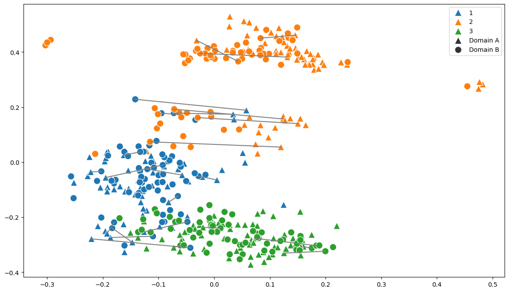
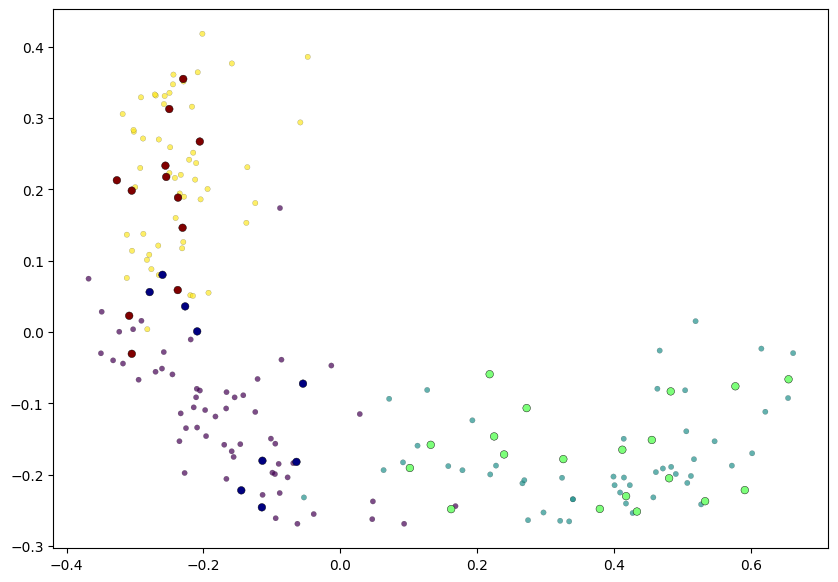

# TwinAE-MA

## Description
This repository provides implementations for autoencoders enhanced with geometric regularization. These models can map points into established embedding spaces and address manifold alignment challenges. Additionally, the code supports translating data from one domain into its corresponding representation in another. For an in-depth description, visit the paper here: {TODO: ADD LINK}.

This work was largely built off of Geometry Regularized Autoencoders by Andres F. Dugue, Sacha Morin, Guy Wolf, and Kevin R Moon. You can visit their repository here: https://github.com/KevinMoonLab/GRAE 

You can visit the Geometry Regularized Autoencoders paper here: https://ieeexplore.ieee.org/document/9950332

Created March, 2025.


## How to Install
To install the `TwinAEPackage` package, run the following command:

```bash
pip install git+https://github.com/JakeSRhodesLab/TwinAE-MA
```

## Code Example
Below is a quick code example of how to build the twin autoencoder structure, train the networks, and then make predictions. 

*Example:*
```python
from demonstration_utils.helpers import *
import numpy as np

# Initialize the data
seeds = np.load(PATH + "seeds/emb.npy")
anchors = np.load(PATH + "seeds/anchors.npy")
labels = np.load(PATH + "seeds/labels.npy")

#Plot given embedding
plot_embeddings(seeds, np.hstack([labels, labels]), anchors)
```


```python
# First, we need to train the autoencoder
from AutoEncoders import GRAEAnchor

# Load in the data
PATH = "demonstration_utils/"
train_emb = np.load(PATH + "seeds/train_emb.npy") 
trainA = np.load(PATH + "seeds/trainA.npy")
testA = np.load(PATH + "seeds/testA.npy")
train_labels = np.load(PATH + "seeds/train_labels.npy")

# Train the autoencoders
AutoEncA = GRAEAnchor(lam=100, anchor_lam=100, relax=False, n_components = 2)
AutoEncA.fit(trainA, train_emb, anchors)

#NOTE: We can get the predictions with the following line:
pred = AutoEncA.transform(testA)

#Plot the test points
dataA_len, testA_len = len(trainA), len(testA)
AutoEncA.plot(trainA, train_labels[:dataA_len], testA, test_labels[:testA_len])
```


<!-- ## Citations 
View on the paper. -->

## Authors
- Nielsen, Marshall
- Rhodes, Jake
- Rustad, Adam